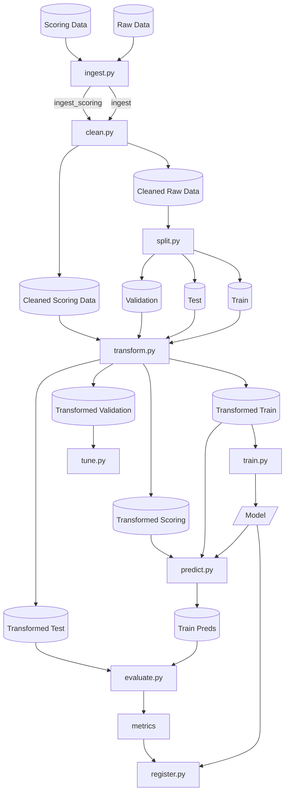
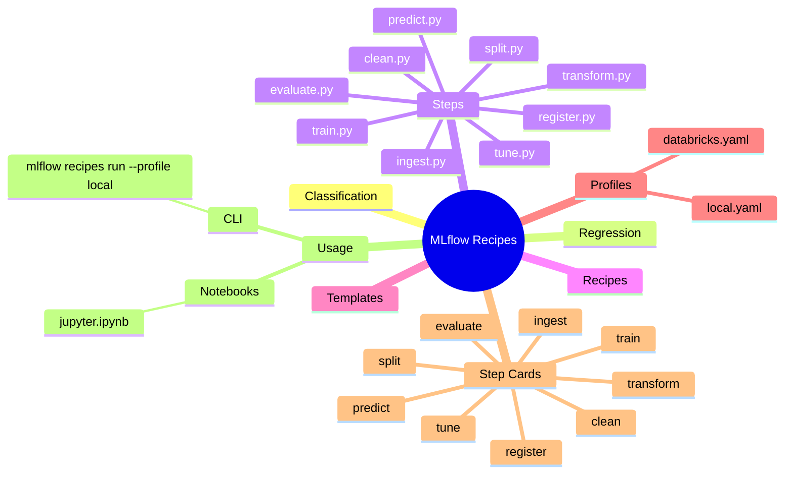

# mlflow-recipes

## MLflow Recipes DAG

```mermaid
graph TD

  RD[(Raw Data)]
  SD[(Scoring Data)]
  CR[(Cleaned Raw Data)]
  CS[(Cleaned Scoring Data)]
  TRD[(Train)]
  TED[(Test)]
  VD[(Validation)]
  TP[(Train Preds)]
  TTR[(Transformed Train)]
  TTE[(Transformed Test)]
  TVD[(Transformed Validation)]
  TS[(Transformed Scoring)]

  M[/Model/]

  IN[ingest.py]
  SP[split.py]
  TR[transform.py]
  T[train.py]
  TU[tune.py]
  EV[evaluate.py]
  RE[register.py]
  PR[predict.py]

  RD --> IN
  SD --> IN
  IN --ingest--> CL[clean.py]
  IN --ingest_scoring--> CL
  CL --> CR
  CL --> CS
  CR --> SP
  SP --> TRD
  SP --> TED
  SP --> VD

  TRD --> TR
  TED --> TR
  VD --> TR
  CS --> TR

  TR --> TTR
  TR --> TTE
  TR --> TVD
  TR --> TS

  TTR --> T
  T --> M
  M --> PR
  TTR --> PR
  TS --> PR

  PR --> TP
  TP --> EV
  TTE --> EV --> MET[metrics]

  M --> RE
  MET --> RE

  TVD --> TU

```

## Mindmap

```mermaid
mindmap
  root((MLflow Recipes))
    Classification
    Regression
    Steps
      ingest.py
      clean.py
      split.py
      transform.py
      train.py
      tune.py
      evaluate.py
      register.py
      predict.py
    Recipes
    Templates
    Profiles
      databricks.yaml
      local.yaml
    Step Cards
      ingest
      clean
      split
      transform
      train
      tune
      evaluate
      register
      predict
    Usage
      Notebooks
        jupyter.ipynb
      CLI
        mlflow recipes run --profile local
```
