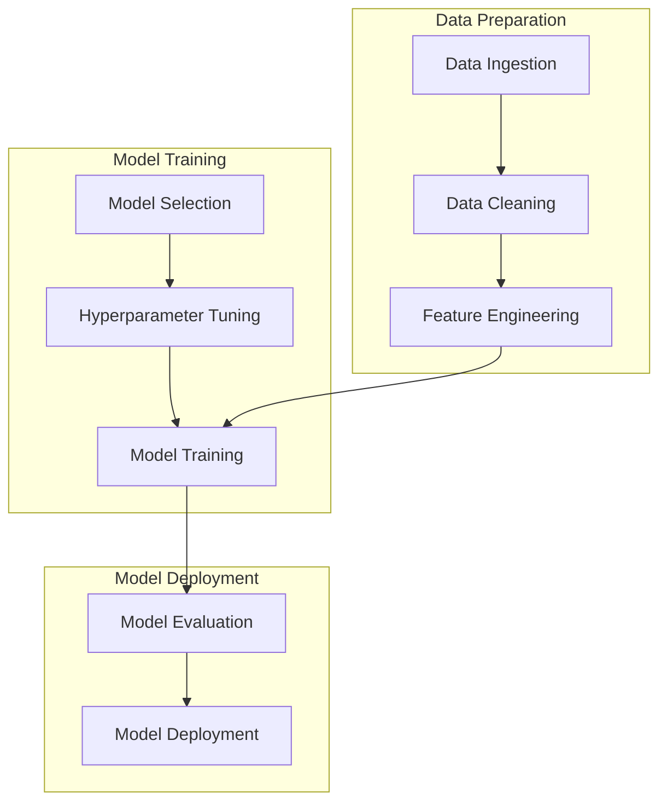

# mlflow-recipes

## Machine Learning Pipeline

```mermaid
graph TD
    subgraph Data Preparation
    A[Data Ingestion] --> B[Data Cleaning]
    B --> C[Feature Engineering]
    end
    subgraph Model Training
    D[Model Selection] --> E[Hyperparameter Tuning]
    E --> F[Model Training]
    end
    subgraph Model Deployment
    G[Model Evaluation] --> H[Model Deployment]
    end
    C --> F
    F --> G
```
