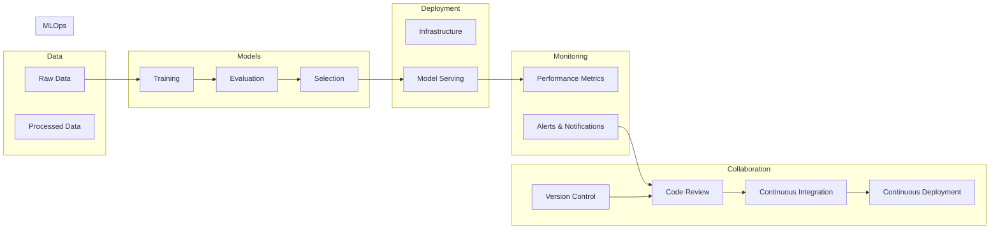
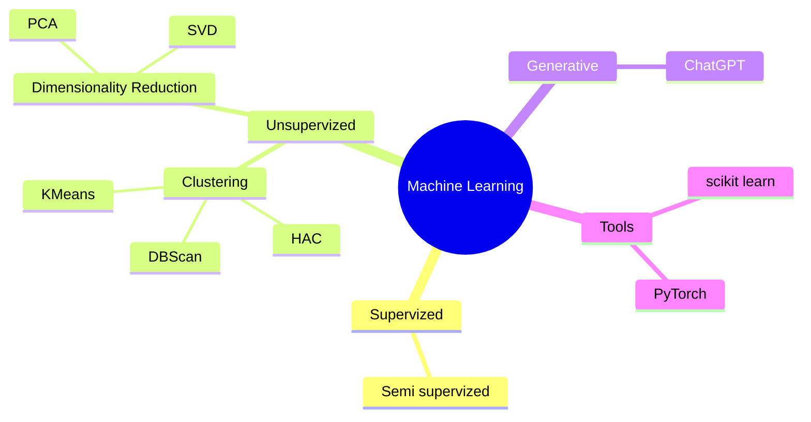
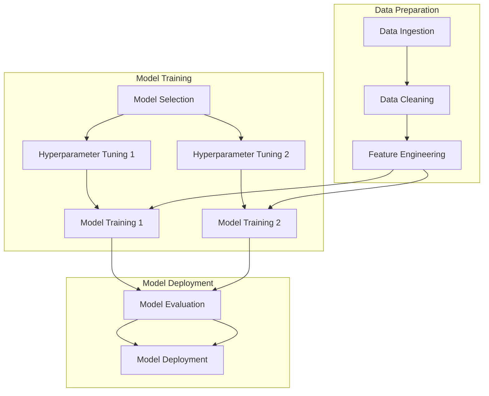

# mlflow-recipes

## MLOps

```mermaid
graph LR
  subgraph Data
    D1[Raw Data]
    D2[Processed Data]
  end

  subgraph Models
    M1[Training]
    M2[Evaluation]
    M3[Selection]
  end

  subgraph Deployment
    S1[Infrastructure]
    S2[Model Serving]
  end

  subgraph Monitoring
    A1[Performance Metrics]
    A2[Alerts & Notifications]
  end

  subgraph Collaboration
    C1[Version Control]
    C2[Code Review]
    C3[Continuous Integration]
    C4[Continuous Deployment]
  end

  subgraph MLOps
    D1 --> M1
    M1 --> M2
    M2 --> M3
    M3 --> S2
    S2 --> A1
    A2 --> C2
    C1 --> C2
    C2 --> C3
    C3 --> C4
  end

```

## Mindmap

```mermaid
mindmap
  root((Machine Learning))
    Supervized
      Semi supervized
    Unsupervized
      Clustering
        HAC
        DBScan
        KMeans
      Dimensionality Reduction
        PCA
        SVD
    Generative
      ChatGPT
    Tools
      scikit learn
      PyTorch
```

## Machine Learning Pipeline

```mermaid
graph TD
    subgraph Data Preparation
    A[Data Ingestion] --> B[Data Cleaning]
    B --> C[Feature Engineering]
    end
    subgraph Model Training
    D[Model Selection] --> E[Hyperparameter Tuning 1]
    D --> F[Hyperparameter Tuning 2]
    E --> G[Model Training 1]
    F --> H[Model Training 2]
    end
    subgraph Model Deployment
    I[Model Evaluation] --> J[Model Deployment]
    end
    C --> G
    C --> H
    G --> I
    H --> I
    I --> J
```
