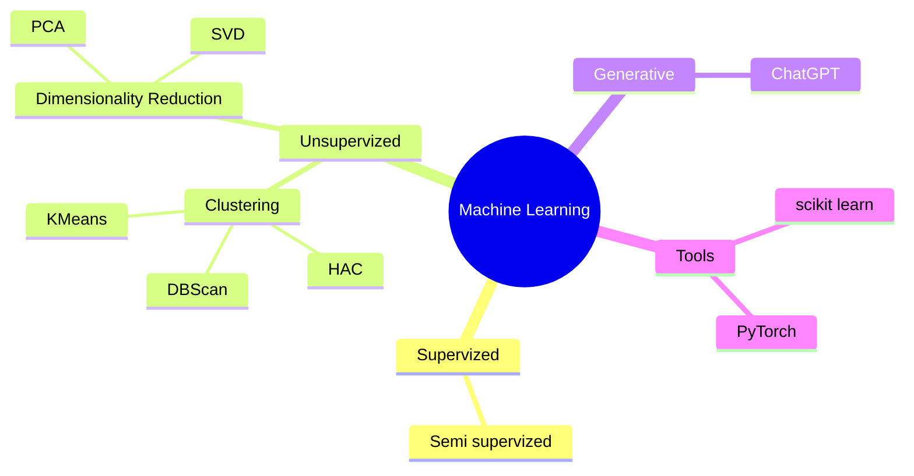
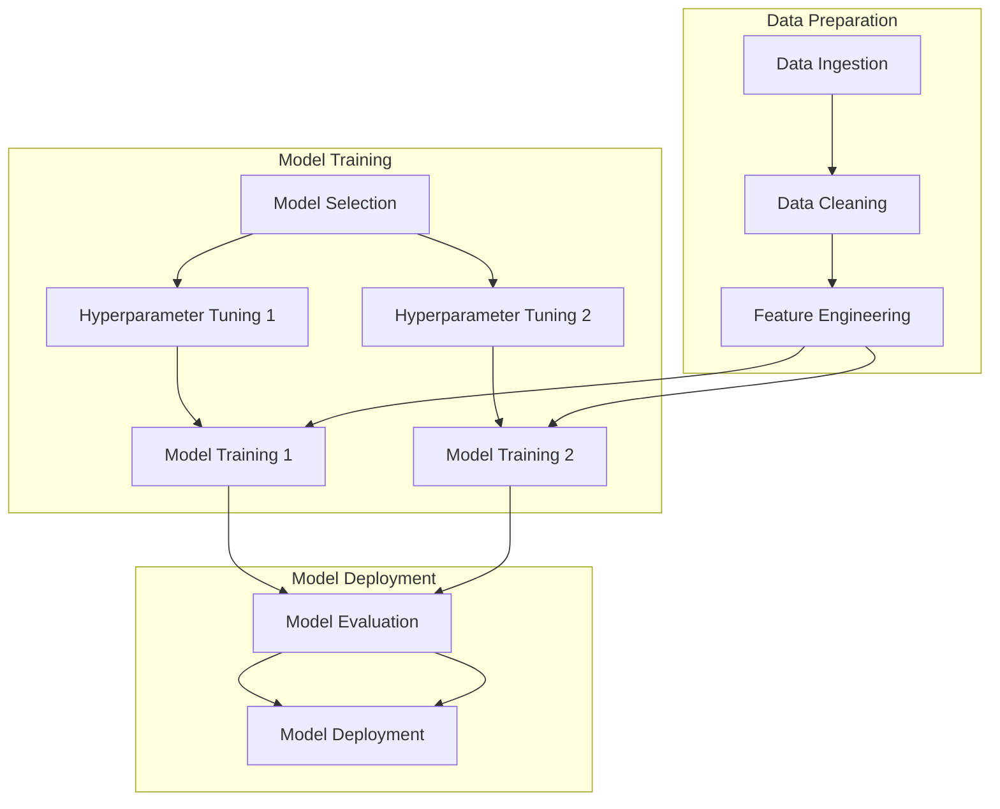

# mlflow-recipes

## Mindmap

```mermaid
mindmap
  root((Machine Learning))
    Supervized
      Semi supervized
    Unsupervized
      Clustering
        HAC
        DBScan
        KMeans
      Dimensionality Reduction
        PCA
        SVD
    Generative
      ChatGPT
    Tools
      scikit learn
      PyTorch
```

## Machine Learning Pipeline

```mermaid
graph TD
    subgraph Data Preparation
    A[Data Ingestion] --> B[Data Cleaning]
    B --> C[Feature Engineering]
    end
    subgraph Model Training
    D[Model Selection] --> E[Hyperparameter Tuning 1]
    D --> F[Hyperparameter Tuning 2]
    E --> G[Model Training 1]
    F --> H[Model Training 2]
    end
    subgraph Model Deployment
    I[Model Evaluation] --> J[Model Deployment]
    end
    C --> G
    C --> H
    G --> I
    H --> I
    I --> J
```
